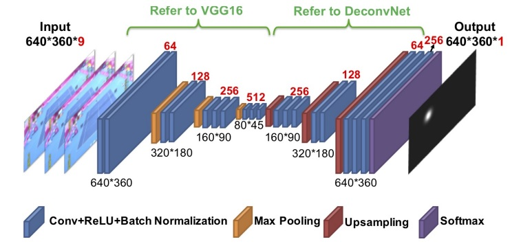

# TrackNet
<i> It's not an official implementation </i> <br>
**Tracknet** is a deep learning network for tracking the tennis ball from broadcast videos in which the ball images are small, blurry, and sometimes even invisible. TrackNet takes multiple consecutive frames as input, model will learn not only object tracking but also trajectory to enhance its capability of positioning and recognition.TrackNet generates gaussian heat map centered on ball to indicate position of the ball.

## Architecture


## Dataset
Dataset consists of video clips of 10 broadcast video. Each video contains several clips from ball serving to score. There are 19.835 labeled frames in the dataset. The resolution, frame rate are 1280×720, 30 fps respectively. In the label file, each frame may have the following attributes: "Frame Name", "Visibility Class", "X", "Y", and "Trajectory Pattern". Click the link https://drive.google.com/drive/folders/11r0RUaQHX7I3ANkaYG4jOxXK1OYo01Ut to download the dataset.

## Getting started
1. Clone the repository `https://github.com/yastrebksv/TrackNet.git`
2. Run `pip3 install -r requirements.txt` to install packages required. 
3. Run `python gt_gen.py <args>` to create ground truth images and train/test labels.
4. Prepare dataset to the following format:
```
datasets/trackNet
    /images
        /game1
            /Clip1
                /0000.jpg
                ...
                /0206.jpg
            ...
            /Clip13
                /0000.jpg
                ...
                /0252.jpg
        ...
        /game10
    /gts
        /game1
            /Clip1
                /0000.jpg
                ...
                /0206.jpg
            ...
            /Clip13
                /0000.jpg
                ...
                /0252.jpg
        ...
        /game10
    /labels_train.csv
    /labels_val.csv
```
5. Run `python main.py` to start training
## Pretrained model
You can check these weights
https://drive.google.com/file/d/1XEYZ4myUN7QT-NeBYJI0xteLsvs-ZAOl/view?usp=sharing to try the model

## Inference on video

Run `python infer_on_video.py <args>` to launch inference on the video. 

## Reference
[https://arxiv.org/abs/1907.03698](https://arxiv.org/abs/1907.03698) <br>
TrackNet: A Deep Learning Network for Tracking High-speed and Tiny Objects in Sports Applications
